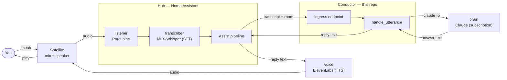
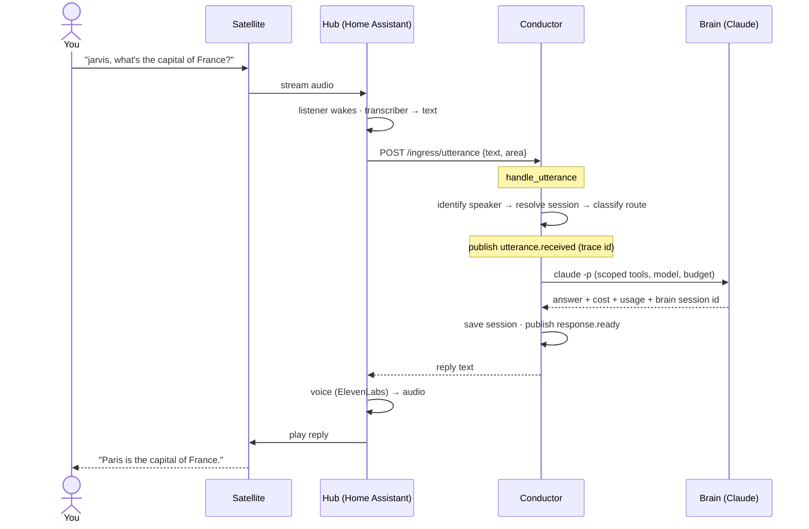
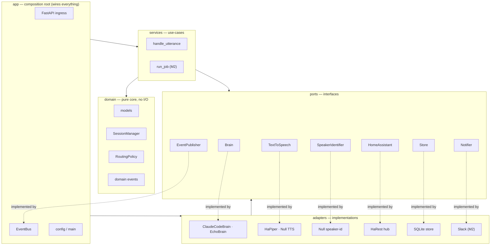
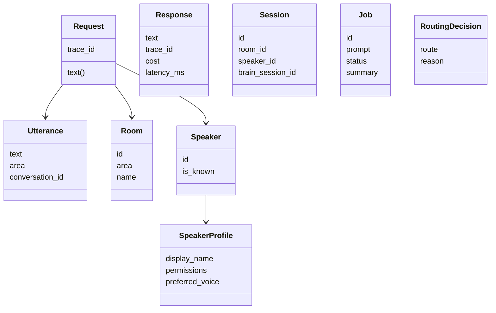
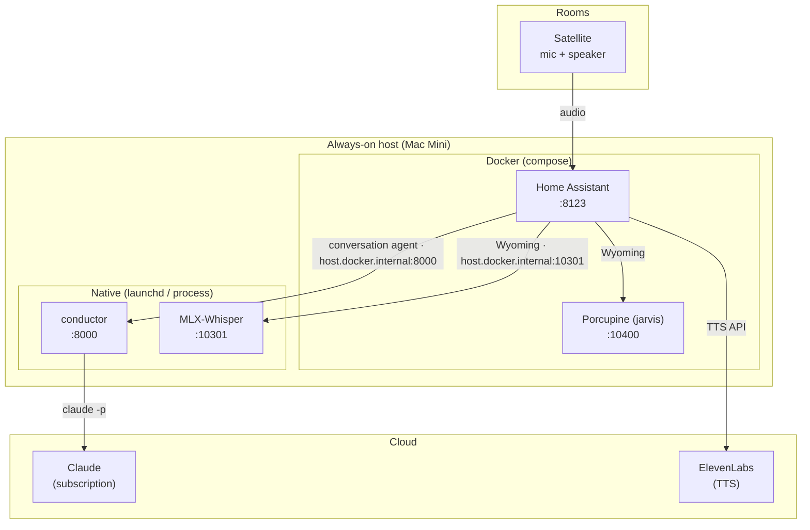

# Jarvis — Architecture

A guided tour of how Jarvis works, for someone seeing it for the first time. It
starts with the big picture in plain English, then drills into the pieces with
diagrams. (For the project vision and design principles, see the top-level
[`README.md`](../README.md); this doc focuses on *how it actually fits together*.)

---

## 1. What is Jarvis?

Jarvis is a **whole-home voice assistant** that runs on your own network. You say
"jarvis," ask a question in any room, and hear an answer spoken back — with
**Claude as the brain**. It's built from small, clearly-named parts so it stays
understandable as it grows, and so any engine (the voice, the transcriber, even
the brain) can be swapped without rewriting the system.

There are two halves:

- **The voice path** — microphones, wake word, speech-to-text, text-to-speech.
  This is *assembled* from existing tools (Home Assistant + Wyoming + Whisper +
  ElevenLabs).
- **The conductor** — the app in *this repo*. It's the coordinator: it takes a
  transcribed question, decides what to do, asks the brain, and sends the answer
  back to the right room.

---

## 2. The cast (naming conventions)

Every part has a plain, role-based name. **A component is never named after the
technology behind it** — it's the `brain`, and Claude is merely today's
implementation. Swap Claude for something else and it's still the `brain`.

| Name | Role | Today's tech | In the code |
|------|------|--------------|-------------|
| **mic** | captures your voice | satellite microphone | (external device) |
| **speaker** | plays the reply | satellite speaker | (external device) |
| **listener** | wakes on "jarvis" | Porcupine | (external Wyoming service) |
| **transcriber** | speech → text | MLX-Whisper (Apple Silicon GPU) | [`native/whisper/`](../native/whisper) |
| **voice** | text → speech | ElevenLabs (cloud) | `TextToSpeech` port → `HaPiper`/`Null` adapters |
| **hub** | routes audio, owns devices | Home Assistant | `HomeAssistant` port → `HaRestHub` adapter |
| **conductor** | decides how each request flows | this repo | `jarvis/` |
| **brain** | reasons, answers, (later) writes code | Claude (subscription) | `Brain` port → `ClaudeCodeBrain` adapter |
| **messenger** | pings you when async work finishes | Slack/push *(M2)* | `Notifier` port |
| **dashboard** | configures the system | React + Vite *(M3)* | `dashboard/` *(future)* |

Two recurring code words:

- **Port** — an *interface* (a Python `Protocol`) describing what something does,
  e.g. `Brain.invoke(...)`.
- **Adapter** — a concrete *implementation* of a port, e.g. `ClaudeCodeBrain`.

---

## 3. The big picture



In words: your satellite streams audio to the **hub**; the hub wakes on "hey
jarvis," transcribes your words, and forwards the text to the **conductor**; the
conductor asks the **brain**; the answer comes back through the hub, is turned
into speech by the **voice**, and plays on your **speaker**.

Only **text** (your transcript) and the **reply text** leave your network — to
Claude and to ElevenLabs respectively. The audio path is local. (Staying fully
local is possible too — see "swappable engines" below.)

---

## 4. How one question flows



Key ideas visible here:

- **Sessions** give continuity — a follow-up like "what about Spain?" within a
  few minutes continues the same brain conversation, keyed by *(room, speaker)*.
- **Routing** decides `QUICK_QA` (answer now) vs `ASYNC_JOB` (kick off work,
  notify later — M2).
- **Events** (`utterance.received`, `response.ready`, …) are published at each
  stage; observers like logging subscribe to them and never sit in the request's
  critical path. Every event carries a **trace id** so one request can be
  followed end to end.

---

## 5. Inside the conductor (ports & adapters)

The conductor is a **modular monolith** built in the *hexagonal* style: a pure
core that depends on nothing external, with everything that touches the outside
world hidden behind a **port** and supplied by an **adapter**.



The dependency rules (enforced by tests in `tests/test_boundaries.py`):

1. **`domain/`** imports nothing external — not adapters, not even third-party
   libraries. Pure Python data + logic.
2. **`ports/`** import only the domain.
3. **`adapters/`** depend on ports; **never** on each other, on `app`, or on
   `services`.
4. **`services/`** (use-cases) orchestrate the domain + ports; they don't know
   which concrete adapter they're using.
5. **`app/`** is the only place that picks adapters and wires them together (the
   "composition root").

This is why engines are swappable: `handle_utterance` only knows the `Brain`
port, so `ClaudeCodeBrain` (real) and `EchoBrain` (tokenless) are interchangeable
via config — same for the voice (`HaPiper` vs `Null`), the store, and so on.

---

## 6. The domain model

The plain data every part speaks (in `jarvis/domain/models.py`). **Value
objects** are immutable; **entities** have identity and changing state.



**Events** (in `jarvis/domain/events.py`), published on the bus: `utterance.received`,
`response.ready`, and `job.started` / `job.completed` / `job.failed` (M2). Each
carries the `trace_id`.

---

## 7. Where it runs (deployment)

The whole system runs on **one always-on host** (a Mac Mini in production). The
conductor and the transcriber run **natively** (the transcriber needs the Apple
Silicon GPU; the conductor needs the Claude subscription credential from the
macOS Keychain, which a container can't read). The hub and wake word run in
**Docker**. The brain and the voice are **cloud** services.



- The hub reaches host-native services via **`host.docker.internal`** (Docker →
  host bridge).
- The conductor is registered as Home Assistant's **conversation agent** through
  a small custom component, [`custom_components/jarvis/`](../custom_components/jarvis),
  which forwards each turn to `/ingress/utterance`.
- Per-room satellites (an ESP32 "Atom Echo", an HA Voice PE, or a Pi running
  `wyoming-satellite`) just point at the hub — the host can live in a closet.

See [`docs/deploy-mac-mini.md`](./deploy-mac-mini.md) for the full deployment
runbook and [`docs/laptop-e2e.md`](./laptop-e2e.md) for testing on a laptop.

---

## 8. Repository map

```
jarvis/
  jarvis/                  # the conductor (Python package)
    domain/                #   pure core: models, SessionManager, RoutingPolicy, events
    ports/                 #   interfaces (Brain, TextToSpeech, HomeAssistant, Store, …)
    adapters/              #   implementations
      brain/               #     ClaudeCodeBrain, EchoBrain
      tts/                 #     HaPiperTextToSpeech, NullTextToSpeech
      speaker_id/          #     NullSpeakerIdentifier
      ha/                  #     HaRestHub
      store/               #     SqliteStore
      ingress/             #     HaConversationIngress
    services/              #   use-cases: handle_utterance (run_job in M2)
    app/                   #   composition root: FastAPI api, EventBus, config, main
  native/whisper/          # native MLX-Whisper Wyoming server (transcriber) + launchd installer
  custom_components/jarvis/# Home Assistant conversation-agent bridge
  config/                  # ha-provision.json (declarative HA config)
  scripts/                 # on-box tools: provision_ha.py, check_brain_billing.sh, wakeword_test.py
  docs/                    # this file, deploy + e2e runbooks
  tests/                   # domain/, services/, adapters/, fakes/ + boundary guards
  docker-compose.yml       # hub + wake word (+ optional piper/whisper, db)
```

---

## 9. Configuration & operations

- **Conductor config** — `JARVIS_*` environment variables (or `.env`), read by
  `jarvis/app/config.py`. Notable: `JARVIS_BRAIN_MODE` (`echo` | `claude`),
  `JARVIS_TTS_MODE` (`null` | `ha_piper`), `JARVIS_HA_TOKEN`.
- **Billing** — the brain uses the **Claude subscription** (OAuth), never an API
  key. `ANTHROPIC_API_KEY` is deliberately absent; the conductor *refuses to
  start* if it's present under subscription mode, and the brain adapter strips it
  from the subprocess environment regardless. (See README §8.)
- **Home Assistant config as code** — instead of clicking the HA UI, desired
  state lives in `config/ha-provision.json` and is applied by
  `scripts/provision_ha.py` (idempotent, via HA's REST + WebSocket APIs).
- **Transcriber service** — `native/whisper/install.sh` installs MLX-Whisper as a
  launchd service.

---

## 10. Swappable engines (why the design pays off)

Because each external thing sits behind a port, changing it is a config flip or a
new adapter — never a rewrite:

| Want to… | Do this |
|----------|---------|
| Answer without spending tokens | `JARVIS_BRAIN_MODE=echo` (uses `EchoBrain`) |
| Use a different/cheaper model | set the model in the brain adapter (tiering, M2 #24) |
| Stay fully local for STT/TTS | use Piper TTS + local Whisper instead of ElevenLabs/cloud |
| Add a new input surface (Slack, a button) | write an **ingress adapter** → produces an `Utterance` |
| Add a new output (a notification) | subscribe an **observer** to `response.ready` / `job.*` |
| Swap the brain engine entirely | write a new `Brain` adapter; nothing else changes |

---

## 11. Status

- **M1 (done):** the walking skeleton above — wake word → question → spoken
  answer, with the real Claude brain, native STT, and cloud voice.
- **Next:** M2 (async coding jobs + messenger + multi-room + model tiering),
  then M3 (the configuration dashboard). See README §12 for the roadmap and the
  GitHub issues for tracked work.
